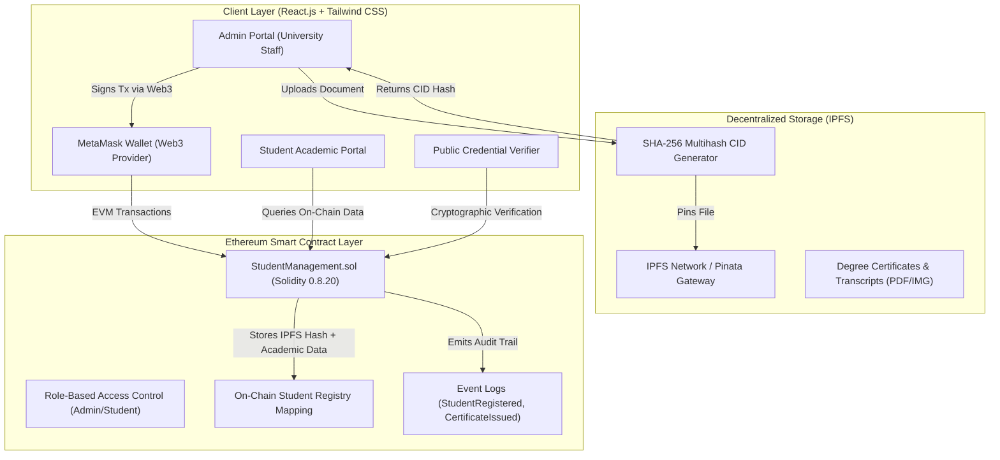

# 🎓 Blockchain-Based Student Management System (EduChain)

A secure, transparent, and decentralized platform designed to efficiently manage, issue, and verify student academic records using the **Ethereum Blockchain** and **IPFS (InterPlanetary File System)**.

---

## 🌟 Overview & Motivation

Traditional student information systems rely on centralized databases vulnerable to:
- **Data Tampering & Fraud**: Unauthorized alteration of grades, marks, and degrees.
- **Single Point of Failure**: Server outages, database corruption, or malicious insider threats.
- **Slow & Tedious Verification**: Employers and universities waiting weeks for manual credential verification.

**EduChain** solves these challenges by leveraging Ethereum smart contracts to ensure data integrity, institutional trust, and cryptographic immutability. 

- **Administrators (Colleges & Universities)** can enroll students, update academic records, and issue tamper-proof certificates.
- **Students** authenticate securely via **MetaMask** to view their decentralized academic identity and download verifiable digital transcripts.
- **Large Credential Files (Degrees/Transcripts)** are stored off-chain on **IPFS**, with only their cryptographic Content Identifier (CID) hash recorded on Ethereum.
- **Third-Party Verifiers (Employers/Recruiters)** can verify credential authenticity on-chain in seconds without logging in.

---

## 🏗️ System Architecture



---

## ✨ Key Features

1. **Role-Based Access Control**:
   - Only authorized institution administrators can register students or issue credentials.
   - Capability to delegate administrative rights to new departmental wallet addresses.
2. **Decentralized IPFS Storage**:
   - Files (PDFs/Images) are cryptographically hashed using standard IPFS v0 CIDs (`Qm...`).
   - Only hashes are committed to Ethereum, minimizing gas costs while keeping certificates permanent and decentralized.
3. **MetaMask Wallet Authentication**:
   - Fast, passwordless Web3 login using digital signatures.
   - Real-time balance detection, network auto-switching, and account change listeners.
4. **Public Zero-Login Verifier**:
   - Anyone (recruiters, visa officers, background check agencies) can verify authenticity by entering a Student ID, pasting an IPFS CID, or dragging and dropping the certificate file directly.
5. **Tamper-Proof Audit Trail**:
   - Every on-chain mutation triggers an Ethereum event (`StudentRegistered`, `CertificateIssued`, `StudentUpdated`), providing an immutable historical ledger.
6. **Dual Mode (Live Blockchain + Interactive Sandbox)**:
   - Works immediately out of the box with an interactive demo mode.
   - Seamlessly executes live transactions when connected to a local Hardhat node or public Ethereum testnet.

---

## 💻 Tech Stack

- **Smart Contracts**: Solidity `^0.8.20`
- **Blockchain Framework**: Hardhat `3.x` / `2.x`, Ethers.js `v6`
- **Decentralized Storage**: IPFS (InterPlanetary File System), SHA-256 Multihash, Pinata API support
- **Frontend**: React.js 18, Vite, Tailwind CSS, Lucide React, Canvas Confetti
- **Testing**: Node.js Test Runner, Chai Assertions

---

## 🚀 Quickstart Guide

### 1. Prerequisites
- **Node.js** (v18 or higher)
- **MetaMask** browser extension ([Download MetaMask](https://metamask.io/))

### 2. Installation
Clone the repository and install all dependencies:

```bash
# In the root directory (smart contract environment)
npm install

# In the frontend directory
cd frontend
npm install
cd ..
```

---

### 3. Compile Smart Contracts
Compile the Solidity smart contracts:

```bash
npm run compile
```

This compiles `contracts/StudentManagement.sol` and automatically places the ABI artifacts into `frontend/src/artifacts/`.

---

### 4. Run Automated Unit Tests
Run the contract test suite:

```bash
npm test
```

---

### 5. Start Local Blockchain & Deploy

#### Terminal 1: Launch Local Hardhat Node
```bash
npm run node
```
*This starts a local Ethereum node at `http://127.0.0.1:8545` with 20 pre-funded test accounts (10,000 ETH each).*

#### Terminal 2: Deploy Contract
```bash
npm run deploy
```
*This deploys `StudentManagement.sol` to your local node and writes the contract address to `frontend/src/contractConfig.json`.*

#### Terminal 3: Start React Frontend
```bash
npm run frontend
```
Open **[http://localhost:5173](http://localhost:5173)** in your browser!

---

## 🦊 Setting Up MetaMask for Local Testing

1. Open **MetaMask** &rarr; **Add Network** &rarr; **Add a network manually**:
   - **Network Name**: `Hardhat Localhost`
   - **New RPC URL**: `http://127.0.0.1:8545`
   - **Chain ID**: `31337`
   - **Currency Symbol**: `ETH`
2. **Import Pre-Funded Test Account**:
   - In MetaMask, click **Import Account** and paste one of the Hardhat private keys:
     - **Admin / Deployer**: `0xac0974bec39a17e36ba4a6b4d238ff944bacb478cbed5efcae784d7bf4f2ff80`
     - **Student (Alex Rivera)**: `0x5de4111afa1a4b94908f83103eb1f1706367c2e68ca870fc3fb9a804cdab365a`
3. Click **Connect MetaMask** in the EduChain navbar to begin!

---

## 📜 Smart Contract Reference (`StudentManagement.sol`)

| Function | Access | Description |
| :--- | :--- | :--- |
| `registerStudent(...)` | `onlyAdmin` | Enrolls student, hashes ID, and records initial IPFS credential |
| `updateStudent(...)` | `onlyAdmin` | Updates academic standing, CGPA, or department |
| `addCertificate(...)` | `onlyAdmin` | Issues additional degree or marksheet with IPFS hash |
| `getStudentRecord(address)` | `Admin/Student` | Returns full student record by wallet address |
| `getStudentRecordById(string)` | `Public` | Queries student record by Roll Number / Student ID |
| `verifyCertificateByHash(string)` | `Public` | Verifies certificate authenticity and returns student proof |
| `getAllStudents()` | `Public` | Retrieves all registered students for the dashboard |
| `addAdmin(address)` | `onlyOwner` | Grants administrative authority to university staff |

---

## 📄 License
This project is licensed under the **MIT License**.
